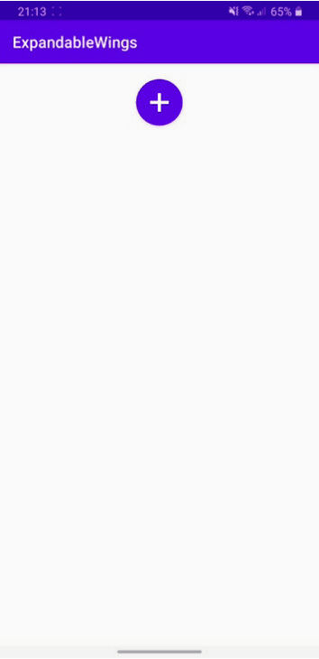

# ExpandableWings Button
 ExpandableWings Button is an android library to create a seamless button expanding on both sides. This library has been implemented using Animation combined with an Android custom view that extends RelativeLayout.
 
 
 
# Download
 Step 1. Add the JitPack repository to your build file
 Add it in your root build.gradle at the end of repositories:

	allprojects {
		repositories {
			...
			maven { url 'https://jitpack.io' }
		}
	}
 Step 2. Add the dependency

	dependencies {
	        implementation 'com.github.agonshehu:ExpandableWings-Button:3.0'
	}
 
 # Usage
 Add ExpandableWings Button to your layout
 
            <com.expandablewings.ExpandableWings
                android:id="@+id/expandableWings"
                android:layout_width="match_parent"
                android:layout_height="wrap_content"
                app:ew_right_backgroundcolor="@color/transparent"
                app:ew_left_backgroundcolor="@color/transparent"
                app:ew_right_textcolor="@color/white"
                app:ew_left_textcolor="@color/white"
                app:ew_right_width="150dp"
                app:ew_left_width="150dp"
                app:ew_left_height="50dp"
                app:ew_right_height="50dp"
                app:ew_left_textsize="15sp"
                app:ew_right_textsize="15sp"
                app:ew_visibility_state="false"
                app:ew_left_text="@string/left"
                app:ew_right_text="@string/right"/>
                
Initialize your ExpandableWings Button widget inside your Activity or Fragment

        ExpandableWings expandableWings = findViewById(R.id.expandableWings);
        expandableWings.setFloatingActionButtonIconRotation(true, 45); // if you want the button to rotate onclick.
        expandableWings.setOnWingClickListener(wings -> {
            switch (wings) {
                case CENTER:
                    expandableWings.toggleFab(); 
                    Toast.makeText(this, "Center", Toast.LENGTH_SHORT).show();
                    break;
                case RIGHT:
                    Toast.makeText(this, "Right", Toast.LENGTH_SHORT).show();
                    break;
                case LEFT:
                    Toast.makeText(this, "Left", Toast.LENGTH_SHORT).show();
                    break;
            }
            expandableWings.toggleFab();
        });
        
To trigger the animation, simply grab a reference to the ExpandableLayout from your Java code and call either expandView(), collapseView()

        if (expandableWings.isExpanded()){
            expandableWings.collapseView();
        } else {
            expandableWings.expandView();
        }
 
 or simply expandableWings.toggleFab().
        
A full demo of the library is included with the project.
